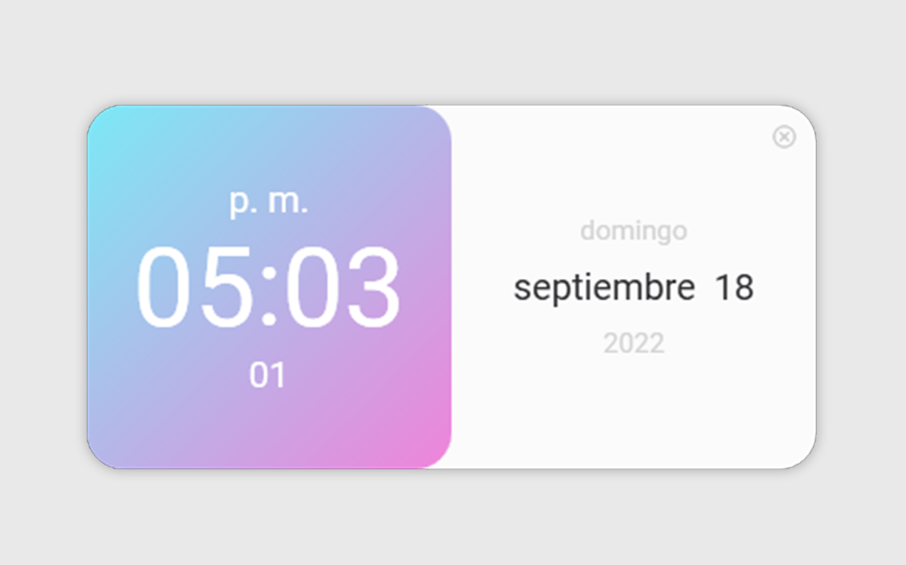

# Cube_Digital_Clock
## Es un simple reloj digital que toma la hora  fecha del sistema diseñado en WPF. 
 
 

 
 

 

 
 
 El archivo que contiene el codigo de logica es: MainWindow.xaml.cs.
 
## El archivo que contiene el codigo de diseño es: MainWindow.xaml.
 
 El archivo que contiene el codigo de los estilos del diseño es: App.xaml
 
 
 

Puedes descargar el archivo instalador desde mega:  https://acortar.link/17vrU7  y probar la aplicacion en tu equipo.
 
 
Sin más nada por el momento me despido, no pares de aprender y si quieres deja para un café XD : https://paypal.me/juancarloscr8
